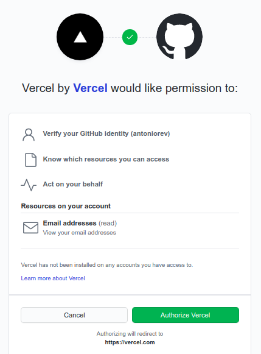
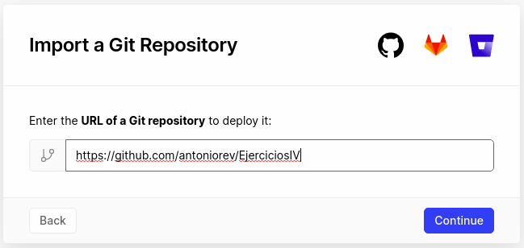
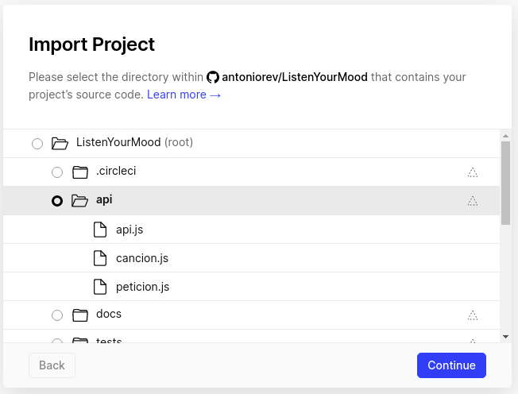
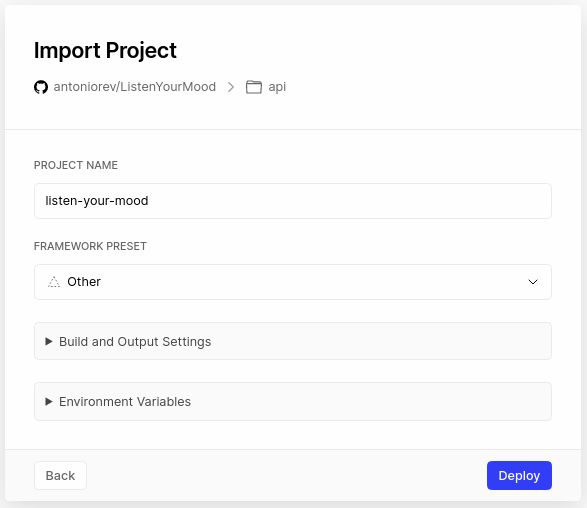
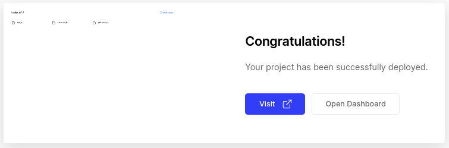

# Configuración de Vercel
Primero que todo, tenemos que registrarnos en la página web de [Vercel](https://vercel.com/). Escogeremos registrarnos con GitHub y le otorgaremos permisos:

Después de esto, escogeremos nuestro directorio para importar:

Pulsamos en continuar, y escogemos la carpeta donde se encuentre el fichero que queremos que se ejecute con cada petición que ocurra:

Es conveniente (como forma de buenas prácticas) que la carpeta donde se encuentre el fichero a ejecutar se llame *api*.

Escogemos a su vez si queremos añadirle un framework, alguna instrucción de construcción, o cambiar alguna variable de entorno (nosotros lo hemos dejado sin tocar)

Y cuando pulsemos en Deploy se desplegará nuestra aplicación:

